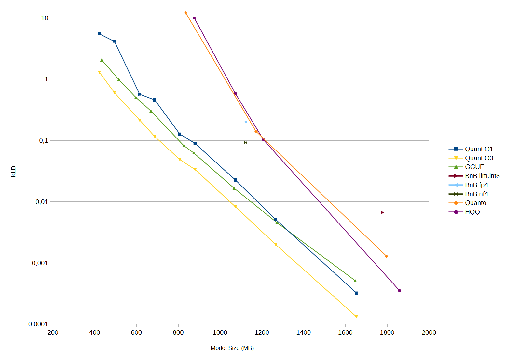

# Quantization

This is a small research project to learn about model quantization. I used a small LLM for testing, but I think the findings should be applicable to any model that uses torch.nn.Linear. The available quantization options are 8, 6, 5, 4, 3 and 2 bits per weight, with a configurable 0.5625 ("L"), 0.3125 ("M") or 0.1875 ("S") additional scale bits. It supports on the fly quantization (O1) and optimization and calibration for lower quantization error (O2 and O3).

All tests were performed with all tensors quantized to the same bits per weight on the Qwen2.5-1.5B model. The exceptions are bitsandbytes which cannot quantize the embeddings and output tensors, and GGUF which cannot quantize those below 3 bpw.

The algorithm performs respectably against industry standards like bitsandbytes and GGUF, even outperforming the latter by a bit, though it likely falls short of newer methods like QTIP or EXL3.

# How it works

The algorithm is based on other microscaling formats like MXFP4, NVFP4 and the different methods in GGUF.
- There are 2 sets of scales, with one super scale in FP8 or FP6 format and sub scales in INT4 format. The groups sizes are 128 for super scales and 8/16/32 for sub scales depending on the configuration.  
- There are 2 methods to encode the weights:
    - The first is faster and is used for 4 bits and up. The actual weight is obtained by dividing the signed integer weight by 2^(N-1)-1, where N is the number of bits, and applying this formula `(abs(x)*x+2x)/3`. As we are using signed integers there is always one more negative value than positive, and this asymmetry leads to poor slot utilization below 4 bits.  
    - At lower bit rates the weights are grouped in pairs, treated as points in a 2D plane and converted into magnitudes and angles. Given N as the number of bits, 2^N-1 values are allocated for magnitudes, 2^N+1 for angles and the last value is allocated for the 0. This gives much more even slot utilization, necessary for optimal quantization.

### Optimization

The naive way to get the scaling factor is to find the largest absolute value in the block. But this doesn't always produce the smallest quantized error. For example, take the following weights:

`weights = [0.15, 0.29, -0.26, 0.96]`

We will quantize them using a 4 bit integer, so we have the values:

`[-1, -0.875, -0.75, -0.625, -0.5, -0.375, -0.25, -0.125, 0, 0.125, 0.25, 0.375, 0.5, 0.625, 0.75, 0.875, 1]`

If we set the scaling factor as 0.6 the weights become [0.15625, 0.302083, -0.27083, 1]. After asigning them to their closest points we get an MSE of 0.00412. If we instead set the scale to 0.98, we get an MSE of 0.00354. Because my method uses heavily quantized scales I simply use a brute force search for the optimal scales.

### Calibration

The basic nn.Linear module performs a simple matrix multiplication (model weights) with the input vector (activations), and outputs a new vector. Each value of the output vector is thus the dot product of a row of the model weights and the input vector. This looks like this:  

`out[0] = (weight[0][0] * in[0]) + (weight[0][1] * in[1]) + (weight[0][2] * in[2])...`

Now let's assume that we have to apply an error of 0.2 to any one of the model weights. To which one should we apply the error to get the smallest error possible in the final output? To the smallest input vector.  

The calibration pass records the average quadratic value of the activations, and then uses that to perform a weighted mean squared error on the optimization pass.

# Learnings

- Affine quantization (having a zero point along with the scale) is basically useless as the distribution of weights is centered at zero.
- It is better to have heavily quantized scales and smaller groups. At low bits you can get away with a single mantissa bit.
- KLD seems proportional to the MSE of the quantized weights all the way down to ~3.2 bits. At 2 bits the KLD explodes, possibly because the model is so quantized that it just stops functioning. This also means that the KLD quadruples with every removed bit, making it very hard to get to low bits per weight.
- Bigger models are less sensitive to quantization. This is likely due to having to store less information per weight. For example, for the Qwen2.5 family:  

| Model | KLD    |  
| ----- | ------ |  
| 0.5B  | 0.122  |
| 1.5B  | 0.0895 |
| 3B    | 0.0802 |
| 7B    | 0.0446 |

- Some tensors are more sensitive to quantization than others. A small test with Qwen2.5-7B shows:

| Tensor        | Size (GB) | KLD    | %improv. | Δsize (GB) | %/Δ     |
| ------------- | --------- | ------ | -------- | ---------- | ------- |
| All IQ4_XS    | 4.052     | 0.0544 | -        | -          | -       |
| embed Q6_K    | 4.210     | 0.0540 | 0.00758  | 0.157      | 0.04814 |
| attn_v Q6_K   | 4.067     | 0.0515 | 0.05411  | 0.014      | 3.64373 |
| attn_k Q6_K   | 4.067     | 0.0537 | 0.01375  | 0.014      | 0.92607 |
| attn_q Q6_K   | 4.156     | 0.0536 | 0.01520  | 0.103      | 0.14625 |
| attn_o Q6_K   | 4.156     | 0.0544 | 0.00082  | 0.103      | 0.00794 |
| ffn_down Q6_K | 4.602     | 0.0455 | 0.16402  | 0.549      | 0.29847 |
| ffn_gate Q6_K | 4.602     | 0.0494 | 0.09273  | 0.549      | 0.16875 |
| ffn_up Q6_K   | 4.602     | 0.0480 | 0.11826  | 0.549      | 0.21520 |
| output Q6_K   | 4.210     | 0.0298 | 0.45232  | 0.157      | 2.87122 |

# Thanks

Georgi Gerganov and the llamacpp team for developing such a great engine  
Iwan Kawrakow for his work on quantization
